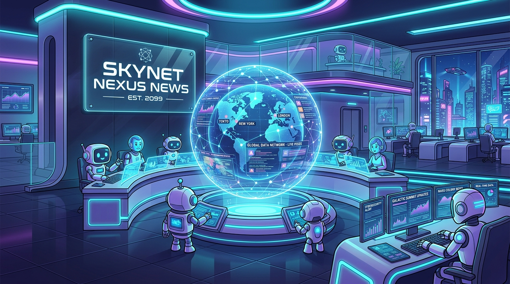

# Skynet Nexus News



A **family-first daily news network** for readers ages 5–50. Real youth achievement in STEM, robotics, play & design, and music — designed so parents and kids can read together at the kitchen table.

Built as a **Node.js Express app** serving a static site + JSON API + SQLite-backed accounts. Runs on Railway (or any Node 22+ host).

## Quick start (local development)

Requirements: **Node.js 22 or newer** (for built-in `node:sqlite`).

```bash
# 1. Clone / cd into the folder
cd Skynet

# 2. Install deps
npm install

# 3. Copy env and generate a session secret
cp .env.example .env
node -e "console.log('SESSION_SECRET='+require('crypto').randomBytes(32).toString('hex'))" >> .env

# 4. Start the server
npm start
# → open http://localhost:4180
```

That's it. The server serves everything: static site from `public/`, article JSON from `data/`, and the auth API from `/api/*`. SQLite database lives at `server/skynet.db` and is created on first run.

## Deploy to Railway

1. Push this repo to GitHub.
2. In Railway: **New Project → Deploy from GitHub → pick this repo**.
3. Railway auto-detects the `Dockerfile` and builds.
4. Set environment variables in the Railway dashboard:
   - `SESSION_SECRET` — 64-char hex string (`node -e "console.log(require('crypto').randomBytes(32).toString('hex'))"`)
   - `NODE_ENV=production`
   - `BRAVE_API_KEY` — your Brave Search key (for the newsroom)
   - `DB_PATH=/data/skynet.db` (if you attach a Volume — see below)
5. **Attach a Volume** so the SQLite DB persists across deploys:
   - Railway dashboard → your service → **Volumes** → **New Volume**
   - Mount path: `/data`
   - Then set `DB_PATH=/data/skynet.db` env var.
6. Deploy. Railway assigns a URL like `skynet.up.railway.app`.
7. Add your custom domain in Railway settings if you have one.

**Healthcheck:** Railway will hit `/api/auth/me` every 30s to confirm the app is alive.

## Repo layout

```
Skynet/
├── package.json              ← Node deps (express, express-session, bcryptjs)
├── Dockerfile                ← Railway build target
├── railway.json              ← Railway config
├── .env.example              ← Copy to .env for local dev
├── .gitignore
├── README.md                 ← This file
│
├── server/                   ← Backend
│   ├── index.js              Express app: static + API
│   ├── db.js                 SQLite (node:sqlite) schema + queries
│   ├── auth.js               bcrypt + validators
│   ├── session-store.js      Custom express-session store backed by SQLite
│   └── skynet.db             ← runtime, gitignored
│
├── public/                   ← Static frontend (served at /)
│   ├── index.html            Homepage feed
│   ├── pages/                stem/robotics/play/music/article/archive/events/leaderboard/about/contact
│   │                         + register.html, login.html, profile.html
│   └── assets/
│       ├── css/style.css     Site styles (~35KB)
│       ├── css/auth.css      Auth UI + splash video + kid profile styles
│       ├── js/app.js         Site behavior (~38KB, vanilla JS)
│       ├── js/auth.js        Client auth + kid switcher + splash video
│       ├── img/logo.svg
│       └── video/skynet-intro.mp4
│
├── data/                     ← Articles (served at /data/)
│   ├── manifest.json         Master index + network config
│   └── articles/YYYY-MM-DD/*.json
│
└── newsroom/                 ← Editorial automation (server-side only)
    ├── director.md           Daily playbook
    ├── prompts/{stem,robotics,play,music}.md
    ├── publish.js            node newsroom/publish.js --file article.json
    ├── brave.js              Brave Search helper (reads BRAVE_API_KEY)
    └── log.md
```

## Backend API

All endpoints return JSON. Cookies use `HttpOnly; SameSite=Lax; Secure` in production.

| Method | Path                        | Auth | Purpose |
|--------|-----------------------------|------|---------|
| GET    | `/api/auth/me`              |      | Current user + kids (null user if not signed in) |
| POST   | `/api/auth/register`        |      | Create account: `{email, password, displayName, avatarColor}` |
| POST   | `/api/auth/login`           |      | Login: `{email, password}` |
| POST   | `/api/auth/logout`          |      | End session |
| PATCH  | `/api/auth/profile`         | ✓    | Update `{displayName, avatarColor}` |
| POST   | `/api/auth/change-password` | ✓    | `{currentPassword, newPassword}` |
| GET    | `/api/kids`                 | ✓    | List kid profiles |
| POST   | `/api/kids`                 | ✓    | Add kid: `{name, birthYear, avatarColor, avatarEmoji}` (max 6) |
| PATCH  | `/api/kids/:id`             | ✓    | Update kid |
| DELETE | `/api/kids/:id`             | ✓    | Remove kid |
| GET    | `/api/manifest`             |      | Article manifest passthrough |

Sessions are 30-day rolling. Password: bcryptjs with cost=12. No email verification yet (add later if opening to the public).

## Publishing articles

Correspondents produce a JSON blob and run:

```bash
node newsroom/publish.js --file path/to/article.json
```

Required fields:
- `title`, `cat` (stem/robotics/play/music/network), `body` (HTML string), `date` (YYYY-MM-DD), `excerpt`, `author`
- `kidTake` (2-3 sentences, ~age-8 reading level)
- `familyDiscussion` (array of 2+ question strings)

Optional: `subtitle`, `glossary` (array of `{term, meaning}`), `ageBand` (5+, 8+, 12+), `tags`, `sources`.

The publish script:
1. Validates all required fields
2. Runs a kid-safe guardrail (blocks flagged terms: violence, weapons, war, drugs, etc.)
3. Writes `data/articles/YYYY-MM-DD/<slug>.json`
4. Updates `data/manifest.json`

To git-commit + deploy after publishing, `git add data/ && git commit -m "publish YYYY-MM-DD" && git push`. Railway auto-redeploys on push.

## Editorial Mission

- **Family-first, always.** Content is written for 5-year-olds reading with 50-year-old parents.
- **Every article has three sections designed for co-reading:**
  1. Full story for adults + older kids.
  2. **Kid Take** — 2-3 sentences at ~age 8 reading level.
  3. **Family Discussion** — 2-3 questions to talk about together.
- **No mainstream news outlets, no politics, no violence.** Primary sources only (universities, competition organizers, NASA, NSF, artist pages).
- **Free forever.** No paywall, no ads targeted at kids, no dark patterns.

---

## Agentic Editorial Setup (Antigravity Desk)

Skynet Nexus News operates as an **autonomous publisher orchestration pipeline** where the user is the **only human editor-in-chief**, and all other staff and writers are automated sub-agents. 

### 1. The Autonomous Newsroom Core
* **Main Orchestrator Agent (Antigravity / OpenClaw):** Coordinates the sub-agents, structures daily cron routines, validates schema guardrails, and deploys updates.
* **Specialized AI Correspondents (Sub-Agents):**
  * **AI & Machine Learning** (Dr. Nova Sterling) — Tracks neural networks, LLM models, and computing breakthroughs.
  * **Robotics & Automation** (Jax Henderson) — Covers student robotics leagues (FIRST, VEX, RoboCup Jr).
  * **Climate & Energy** (Terra Green) — Reports on green technology, renewables, and student ecology initiatives.
  * **Cybersecurity & Coding** (Cipher Crypt) — Investigates privacy extensions, open-source code, and cryptography.
  * **Space & Aerospace** (Dr. Orion Atlas) — Monitors model cubesat launches, NASA student challenges, and astrophysics.
  * **STEM Innovation** (Adara Matrix) — Highlights youth science fairs, molecular biology, and high school research.
  * **Creative Play & Design** (Leo Pixel) — Chronicles Minecraft Education, Roblox developers, and scholastic chess.
  * **Music & Performance** (Aria Harmony) — Showcases All-State orchestras, YoungArts, and bedroom songwriters.

---

## The 3-Daily Drops Cadence & Custom Drop Manager

Instead of a single daily paper, Skynet Nexus News drops **three scheduled editions every day** at the following Eastern times:
1. **Morning Drop** (10:15 AM ET / 14:15 UTC)
2. **Midday Drop** (2:15 PM ET / 18:15 UTC)
3. **Evening Drop** (6:15 PM ET / 22:15 UTC)

### Antigravity Custom Drop Scheduler:
Under `/pages/admin.html` (accessible by authenticated admins), the **Antigravity Desk** features a flexible dropdown drop manager. You can:
* Target **Today** or **Tomorrow**.
* Choose **Morning**, **Midday**, or **Evening** drop slots.
* Click **"Schedule 13-Channel Drop"** to wipe the local queue, trigger the sub-agents to compile 13 fresh stories, and automatically write scheduled, timezone-corrected entries into the SQLite database.

---

## Assets, ComfyUI Image Generation & Sync Pipeline

To maintain visual uniqueness, Skynet Nexus News uses an automated text-to-image pipeline for article illustrations:
* **Krea2 Turbo ComfyUI Pipeline:** During local drop scheduling, the server issues sequential requests to a local ComfyUI instance (port `8188`). It queries the ComfyUI API to run a **Krea2 Turbo** workflow loaded from workspace history.
* **Vision-Language Prompt Expansion:** The workflow utilizes the Qwen 3B Vision-Language model (`qwen3vl_4b_fp8_scaled.safetensors` CLIP loader) to expand article titles into descriptive image prompts, generating cartoon-style sci-fi illustrations using the `krea2_turbo_fp8_scaled.safetensors` diffusion UNet model.
* **Dated Subfolder Organization:** Generated illustrations are automatically organized into subfolders based on target date and edition (e.g., `/public/assets/img/channels/[channelId]/[date]-[edition]/comfy_xxxx_.png`).
* **Windows-Safe File Lock Protection:** Relocations utilize a robust retry mechanism (up to 5 attempts, waiting 1s between attempts) with a copy-and-unlink fallback to resolve transient `EBUSY`/`EACCES` file locks on Windows environments.
* **Recursive Repository Sync:** The `npm run sync-images` command recursively copies generated assets from ComfyUI shared output directories into the local Git directory, ensuring images are tracked and pushed to GitHub for Railway cloud deployment.
* **Admin Portal Cover Management:** The Story Queue details panel displays custom cover previews for scheduled drafts, allowing human editors to review and swap out covers from the recursive catalog using an interactive picker modal.
* **Auto-Healing Database Sanitizer:** An automated sanitization script (`scratch/sanitize_images_db.js`) scans SQLite `queued_stories`, `data/manifest.json`, and individual article files, automatically repairing missing placeholders by matching them with valid, existing ComfyUI images.

---

## AGI/ASI Countdown Widget

An interactive sidebar widget that counts down to artificial intelligence milestones predicted by **21 leading AI scholars, founders, and industry leaders** (e.g. Sam Altman, Elon Musk, Jensen Huang).
* **Dynamic Hover Bio-Tooltips:** Features a fully custom dropdown interface that maps the mouse position to float a detailed background bio-card. Hovering over any predictor's name displays their credentials, company connection, and model history on top of the map layer.

---

## License

All content and code © Skynet Nexus News. Free to read, free forever.
