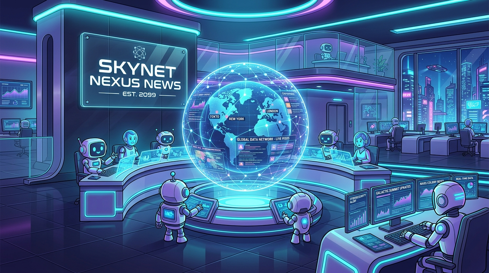

# Skynet Nexus



**The Nexus of STEM for families** — daily news, hands-on activities, and safe community for readers ages 5–50. Three kid-safe editions every weekday, a Saturday STEM lab, parent-controlled kid dashboards, teacher classrooms, and Discord-style family chats. Free forever, no ads targeted at kids.

Built as a **Node.js Express app** (static site + JSON API + SQLite). Runs on Railway (or any Node 22+ host).

## What it does

### 📰 Read — Daily STEM news
- **Three editions daily** (7:15 AM / 2:15 PM / 6:15 PM ET), 13 channels: AI, Space, Robotics, Biotech, Quantum, Climate, Engineering, Math, Cyber, Gaming, Music, STEM Signal, Play & Design
- Every article: full story + **Kid Take** (age-8 reading level) + **Family Discussion** questions + glossary
- **Listen** — studio-quality narration (Piper TTS, 4 voices) on every article
- **Daily Quiz** — 5 questions from the day's stories, XP rewards
- **Ask the Correspondent** — moderated kid Q&A
- **Weekend Lab** — 5 hands-on STEM activities every Saturday, picked by Thursday family vote
- Nexus Glow hero art (house style) + media galleries + trusted sources on every story

### 🚀 Kids — Cinematic dashboards
- Personal **My Space**: animated starfield, custom banner, editable quote, interest picker
- **100 Nexus Glow avatars** to choose from
- Achievement wall (20 badges), XP bar, reading streak, **quiz galaxy** with score history
- Weekly **reading goals** with animated progress ring
- **Printable achievement certificates**
- Full **accessibility suite**: audio guide, voice commands ("read this", "next story"), gesture navigation, large text, high contrast — enabled when parents declare blindness/low vision

### 👨‍👩‍👧 Parents — Control center
- **Family tree**: invite codes link spouses, grandparents, aunts/uncles, cousins
- **Per-kid controls**: Listen on/off, channel allowlist (13 channels), discussions on/off, public chat access (default OFF)
- **Quiet hours**: pause kid chat on a schedule (server-enforced)
- **Comment & question history** with links to join the thread
- **Weekly digest**: XP, stories, quiz average, new badges per kid
- **Family leaderboard**: sibling XP race with medals
- **Child safety rules** posted on the dashboard (not buried in fine print)
- **Parental consent** verification flow

### 🏫 Teachers — Enterprise classrooms
- **Public profiles**: photo, bio, teaching quote, degrees, awards, school/subjects
- **Email invites** to parents (teachers can never add kids directly)
- **Class settings**: Listen toggle, channel filters (parents can further restrict)
- **At-risk list**: flags students idle 3+/7+ days with XP/streak context
- **Assignment completion matrix**: students × assignments grid
- Progress dashboard, discussions, assignments, drop alerts

### 💬 Safe chat (Discord-style)
- **Four space types**: Family (private), Classroom (teacher-admin, parent-moderator), Solo notes, Public Square
- **Invite-gated**: family/classroom codes unlock social; solo signup = reading-only
- **Kids default-deny** on public — parent must explicitly allow
- Profanity filter, message delete (mods/own), 🚩 reporting
- **Moderation queue** for admins/moderators with dismiss/delete actions
- Familiar Discord UI: server rail, channel sidebar, member list, day separators

### 🛡️ Safety architecture
- Invite-only social features; no open-door signup
- Parents own all kid data; teachers see classroom stats only
- No kid-to-kid direct contact outside moderated spaces
- COPPA-aligned: verifiable parental consent, no ads, no trackers

## Quick start

Requirements: **Node.js 22+** (for built-in `node:sqlite`).

```bash
git clone https://github.com/Add-Interactive/Skynet-Nexus.git
cd Skynet-Nexus
npm install
cp .env.example .env
# set SESSION_SECRET in .env (64-char hex)
npm start
# → http://localhost:4180
```

SQLite DB auto-creates at `server/skynet.db` (or `$DB_PATH`).

## Deploy to Railway

1. Push to GitHub → Railway **New Project → Deploy from GitHub**
2. Set env vars: `SESSION_SECRET`, `NODE_ENV=production`, `NEWSROOM_API_KEY`, `DB_PATH=/data/skynet.db`
3. Attach a **Volume** at `/data` for SQLite persistence
4. Optional: `VAPID_PUBLIC_KEY` / `VAPID_PRIVATE_KEY` / `VAPID_CONTACT` for push alerts, `RESEND_API_KEY` for email

## Repo layout

```
├── server/
│   ├── index.js        Express app (~120KB — keep under ~125KB for push limits)
│   ├── chat.js         Safe chat module (spaces, moderation, quiet hours)
│   ├── plus.js         Engagement module (goals, digest, at-risk, matrix, leaderboard)
│   ├── db.js           SQLite schema + queries (node:sqlite)
│   ├── auth.js         bcrypt + validators
│   └── ...
├── public/
│   ├── index.html      Homepage feed
│   ├── pages/
│   │   ├── profile.html    Parent/teacher dashboard (Win10 tiles)
│   │   ├── kid.html        Cinematic kid dashboard
│   │   ├── chat.html       Discord-style chat
│   │   ├── teacher.html    Public teacher profile
│   │   ├── guide.html      How to Use
│   │   ├── register.html   Signup (invite-aware)
│   │   └── ...
│   └── assets/
│       ├── js/a11y.js          Accessibility (audio guide, voice, gestures)
│       ├── js/listen-kokoro.js Piper TTS playback + voice picker
│       └── img/avatars/        100 kid avatars (SVG, Nexus Glow) + avatars.json
├── data/articles/YYYY-MM-DD/   Published articles
└── newsroom/           Editorial automation (prompts, publishing, director runbook)
```

> **Push note:** keep `server/index.js` under ~125KB raw — the GitHub push tool hits arg limits above that. Split new route groups into `server/<feature>.js` modules.

## Key API routes

| Area | Examples |
|------|----------|
| Auth | `POST /api/auth/register` (invite-aware), `/api/auth/login`, `/api/auth/me` |
| Kids | `GET/POST /api/kids`, `PATCH/DELETE /api/kids/:id`, `GET /api/kids/:id/dashboard`, `PUT /api/kids/:id/profile` |
| Kid settings | `GET/PUT /api/kids/:id/settings` (listen, channels, a11y, public chat), `PUT /api/kids/:id/quiet`, `GET/POST /api/kids/:id/goals` |
| Families | `POST /api/families`, `POST /api/families/join`, `GET /api/families/mine`, `GET /api/families/leaderboard` |
| Classrooms | `POST /api/classrooms/:id/invite`, `POST /api/classrooms/join`, `GET /api/classrooms/:id/settings`, `GET /api/classrooms/:id/at-risk`, `GET /api/classrooms/:id/matrix` |
| Teachers | `GET /api/teachers/:id` (public), `PUT /api/users/profile` |
| Chat | `GET /api/chat/spaces`, `GET/POST /api/chat/spaces/:id/messages`, `DELETE /api/chat/messages/:id`, `POST /api/chat/messages/:id/report` |
| Moderation | `GET /api/moderation/queue`, `POST /api/moderation/reports/:id/resolve` |
| Consent | `POST /api/consent/request`, `POST /api/consent/verify`, `GET /api/consent/status` |
| Digest | `GET /api/digest/weekly` |
| Gamification | `GET /api/gamification/status?kid_id=`, `POST /api/gamification/event` |
| Newsroom | `POST /api/newsroom/drafts`, `POST /api/newsroom/images`, `PUT /api/newsroom/whats-new` (key: `NEWSROOM_API_KEY`) |

## Newsroom pipeline

13 AI correspondent sub-agents (one per channel) file drafts 1 hour before each drop via `POST /api/newsroom/drafts`. The director reviews in the Review Console; **unreviewed drafts auto-publish at drop time** — review is a courtesy, never a blocker.

- Hero art: Nexus Glow house style (1280×720, edition-qualified filenames — `POST /api/newsroom/images` overwrites by filename)
- Filing guardrail: drafts without `/assets/img/...` heroImage are rejected (HTTP 422)
- Audio: Piper TTS pre-generates narration per edition (weekday crons)

Full runbook: `newsroom/director.md`.

## Values

- **Family-first, always.** Designed for co-reading, ages 5–50.
- **Kid-safe by design.** Content guardrails, invite-gated social, parent controls, transparent safety rules.
- **Primary sources only.** Every source labeled.
- **Built for every kid.** Accessibility isn't a feature — it's the foundation.
- **Free forever.** No paywalls, no dark patterns, no ads tracking kids.

---

Built by [Add Interactive Studio](https://addinteractive-production.up.railway.app/). NEXUS = Networked Edge Xperience Uplifting Students.
